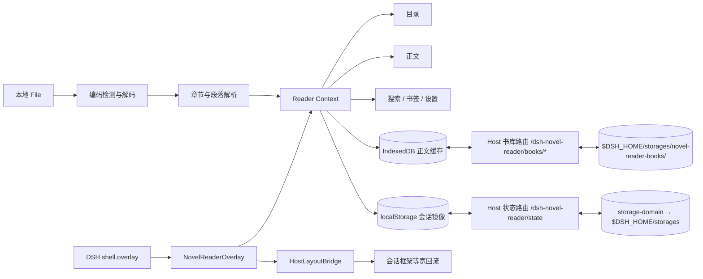

# DeepSeek Harness 侧边栏小说阅读器

一个面向 DeepSeek Harness Web UI 的本地优先小说阅读插件。它通过官方客户端 `shell.overlay` 插槽增量挂载，并在展开时让宿主会话框架等宽回流，因此阅读器与对话区同级并排、不会覆盖正文；小说内容仅在本地读取和保存。

> **持久化说明**：阅读进度、设置、书签与最近打开由插件 Host 半区持久化到 `$DSH_HOME/storages`（通过官方 `storage-domain` 设施），书正文存于 `$DSH_HOME/storages/novel-reader-books/`。因此即使 DSH Desktop 每次启动随机分配 Web 端口（origin 变化导致浏览器 localStorage/IndexedDB 分区失效），阅读进度也不会丢失；浏览器存储仅作为同会话快速缓存与降级后备。

## 1. 架构设计说明

### 技术选型

- **React 18 + TypeScript**：DeepSeek Harness 当前 Web Client 使用 React 18，客户端扩展以 `dsh.client` 包发布。
- **React Context**：阅读器状态是单面板、单书籍域，Context 足以提供强类型状态与动作，不引入额外状态库。
- **Cordis / DSH Slots**：客户端入口只占用可叠加的 `shell.overlay`；可回收的宿主布局桥接按阅读器宽度收窄会话框架，同时保留 DSH 原生工具详情栏。样式与桥接清理均挂入 `ctx.effect()`。
- **Host 半区持久化**：Host 半区通过 `storage-domain` 官方设施把阅读状态落盘到 `$DSH_HOME/storages`（与 DSH 端口无关），并通过 `webServer` 注册 `/dsh-novel-reader/state` 与 `/dsh-novel-reader/books/*` 路由桥接浏览器；书正文以独立 JSON 文件存放，避免大对象进入领域内存表。
- **localStorage + IndexedDB（降级缓存）**：localStorage 保存小型偏好、进度和书签的同会话镜像；IndexedDB 保存正文缓存。Host 不可达时（如纯浏览器嵌入）自动降级，功能不受影响。
- **按章节渲染**：正文始终只渲染当前章节。文件超过 10MB 时仍不会把全书 DOM 一次性挂载，减少内存和布局开销。

### 数据流



### 状态结构

`ReaderContext` 持有以下域：

- `book`：当前 `Book`，包含源文本、章节和段落索引。
- `progressByBook`：以 `bookId` 为键的逐段阅读位置、章节位置与阅读秒数。
- `settings`：字体、字号、行距、主题、目录布局和缩进。
- `panel`：展开状态、280–600px 宽度、折叠按钮纵向位置、沉浸模式和工具栏可见性。
- `bookmarks` / `recents`：书签与最近 10 本书。
- `pendingParagraph`：目录、搜索或书签跳转后的待定位段落。

## 2. 项目目录结构

```text
dsh-novel-reader/
├── .codex-plugin/plugin.json        # 开发工作区元数据，不参与 DSH 运行
├── cordis.patch.yml                 # DSH bundle 配置层
├── package.json                     # dsh.bundle + dsh.client manifest
├── tsdown.config.ts                 # Host ESM + Web Client closure bundle
├── src/
│   ├── index.ts                     # Host 半区：storage-domain 持久化 + webServer 路由桥
│   ├── shared/
│   │   ├── types.ts                 # 核心类型
│   │   ├── launcher-position.ts     # 折叠按钮位置校验、边界和拖拽阈值
│   │   ├── encoding.ts              # UTF-8 / GB18030 检测解码
│   │   ├── parser.ts                # 目录与段落解析
│   │   ├── progress.ts              # 阅读进度
│   │   ├── search.ts                # 全文搜索
│   │   └── file.ts                  # 文件加载与体积降级
│   └── client/
│       ├── index.tsx                # shell.overlay 注册入口
│       ├── host-layout.ts           # 宿主会话框架同级布局桥接
│       ├── styles.ts                # 随插件生命周期注入的样式
│       ├── state/ReaderContext.tsx  # 状态和动作
│       ├── storage/                 # localStorage / IndexedDB
│       └── components/              # 侧栏、目录、正文、设置等
└── tests/                            # 解析、编码、进度、搜索单测
```

## 3. 核心类型定义

完整定义位于 `src/shared/types.ts`：

```ts
interface Book {
  id: string
  name: string
  format: 'txt' | 'markdown'
  encoding: 'utf-8' | 'utf-8-bom' | 'gb18030'
  size: number
  content: string
  chapters: Chapter[]
  paragraphs: Paragraph[]
  largeFileMode: boolean
}

interface Chapter {
  id: string
  index: number
  title: string
  level: number
  start: number
  end: number
  paragraphStart: number
  paragraphEnd: number
}

interface Bookmark {
  id: string
  bookId: string
  chapterIndex: number
  paragraphIndex: number
  excerpt: string
  createdAt: number
}

interface ReaderSettings {
  fontSize: number
  fontFamily: 'system' | 'songti' | 'heiti' | 'kaiti' | 'serif'
  lineSpacing: 'compact' | 'comfortable' | 'relaxed'
  theme: 'light' | 'dark' | 'eye-care' | 'parchment'
  tocPosition: 'top' | 'left'
  firstLineIndent: boolean
  pageMode: 'scroll' | 'paged'
  footerDisplay: 'chapter-progress' | 'chapter-title'
}
```

## 4. 关键组件代码

- `NovelReaderOverlay.tsx`：同级右栏、展开/收起、拖拽宽度、折叠按钮纵向拖拽、快捷键、可切换的章节名称/章节进度底栏与视图切换。
- `FileLoader.tsx`：本地文件选择、加载反馈、错误提示和最近文件。
- `TableOfContents.tsx`：可搜索目录、当前章节高亮、左侧常驻或独立面板模式。
- `ReaderBody.tsx`：当前章节按段落渲染、搜索词高亮、逐段位置追踪，以及上下滚动/仿微信读书左右分页。
- `SettingsPanel.tsx`：12–32px 字号、5 种字体、3 档行距、4 套主题和目录布局。
- `SearchPanel.tsx`：全书搜索，Enter/Shift+Enter 导航，最多返回 500 条。
- `BookmarksPanel.tsx`：逐段书签的查看、跳转和删除。

## 5. 工具函数

- `decodeNovelBuffer()`：先检查 UTF-8 BOM，再用严格 UTF-8 解码，失败后回退 GB18030（覆盖 GBK/GB2312）。
- `parseBookText()`：识别“第 X 章/回/节”“Chapter X”“1. 标题”“001 标题”和 Markdown `#`–`###`。
- `calculateProgress()`：基于全局段落索引计算当前章节和全书百分比。
- `searchBook()`：在段落索引中定位结果，返回章节、段落与摘要坐标。
- `loadBookFromFile()`：格式、体积、编码和解析的统一错误边界。

体积策略：10MB 以下正常加载；10–50MB 启用按章节渲染提示；超过 50MB 拒绝并建议拆卷。即使缓存因配额失败，本次会话仍可继续阅读。

## 6. 平台集成代码

`package.json` 同时声明：

```json
{
  "dsh": {
    "bundle": { "patch": "./cordis.patch.yml" },
    "client": {
      "inject": [
        "@deepseek-ai/dsh-client-runtime",
        "@deepseek-ai/dsh-client-ui-layout"
      ],
      "platform": "web"
    }
  }
}
```

`cordis.patch.yml` 把包加入 profile；`src/client/index.tsx` 使用：

```ts
ctx.slots.inject('shell.overlay', () => ctx.slots.register({
  name: 'shell.overlay',
  id: 'dsh-novel-reader',
  order: 90,
}, ReaderSlot))
```

DSH 仍处于 Developer Preview，本项目锁定 `0.1.0-rc.6` 客户端契约。平台升级后应先运行类型检查和 Web 冒烟测试。

## 6.1 DSH Desktop 适配说明

插件对 DSH Desktop 三种壳模式做了针对性适配（无需配置，自动生效）：

- **advanced / extended（桌面自有 frame）**：宿主把 `shell.overlay` 层设在 `z-index:1000`，与应用级弹窗（设置、附件选择器等同为 `z-index:1000`）同层时按 DOM 顺序反而压住弹窗，导致阅读器盖住设置界面。插件将叠加层压到 `z-index:60`（帧内 UI 之上、应用弹窗之下）。
- **compatibility / extended（transform + 裁剪包含块）**：宿主给 overlay 层同时加 `transform` 与 `overflow:hidden`。插件不再缩窄整个 frame 或把阅读器移出 overlay，而是在宿主三栏网格末尾追加一个阅读器专用轨道；对话区照常回流，overlay 保持完整宽度，因此不会再露出黑色/玻璃窗口背景。布局桥还会监听宿主的侧栏、详情栏与窗口尺寸变化，自动重挂阅读器轨道。
- **快捷键隔离**：应用级弹窗（`[aria-modal="true"]`）打开时，阅读器不响应翻页、搜索、展开/收起等快捷键，键盘输入完全交给弹窗。
- **折叠按钮定位**：右侧“阅读”按钮以当前 `shell.overlay` 可视区域为坐标系，自动避开 Desktop 标题栏；窗口缩放或切换壳模式后按相对位置重新布局。

## 7. 安装、运行与打包

### 本地开发

```bash
pnpm install
pnpm run typecheck
pnpm test
pnpm run build
```

在已安装 `dsh` CLI 的环境中，把本目录加入一个 profile：

```bash
dsh plugin --profile reader add ./deepseek-novel-reader
dsh --profile reader --dump-config
dsh --profile reader web
```

如果从 Git 仓库安装，pnpm 10+ 默认禁止依赖运行 `prepare`。需要在该 profile 的 `pnpm-workspace.yaml` 明确允许：

```yaml
allowBuilds:
  dsh-novel-reader: true
```

更安全的分发方式是交付已构建 tarball：

```bash
pnpm run build
pnpm pack
dsh plugin --profile reader add ./dsh-novel-reader-0.1.0.tgz
```

### 使用

1. 启动 DSH Web UI 后，点击右侧“阅读”按钮；收起状态下也可沿右侧边缘上下拖动它，位置会自动保存。
2. 选择 `.txt`、`.md` 或 `.markdown` 文件。
3. 拖动面板左边缘调整宽度；展开状态和宽度会自动保存。
4. `Ctrl/Cmd+F` 打开搜索，`Esc` 关闭搜索；上下滚动模式中左右方向键切换章节，左右翻页模式中按页切换并在章节边界自动衔接；默认按 `Command+/` 可快速展开或收起阅读栏，也可在“设置 → 展开 / 收起快捷键”中点击录制自定义组合键。
5. 点击正文空白/文本区域切换沉浸模式。

## 版本范围

### MVP（本仓库已完成）

- TXT / Markdown、本地编码检测、章节解析与目录过滤
- 侧栏展开/收起、280–600px 宽度拖拽、折叠按钮纵向拖拽、状态恢复和过渡动画
- 逐段进度、双进度条、最近 10 本、书签、上/下一章
- 字体/字号/行距/主题、底部章节名称/进度显示、全文搜索、快捷键和沉浸模式
- 上下滚动与左右分页两种阅读方式，设置自动保存
- 10MB 大文件按章节渲染、50MB 上限与存储失败降级

### V1.0（建议下一阶段）

- EPUB（建议用 Web Worker 解包并对 OPF/NCX/Nav 建索引）
- 超大文件流式解码与虚拟段落列表
- 按日/周阅读时长统计和导出
- Playwright 宿主级视觉回归测试

## 隐私

插件不声明网络请求，不上传小说内容。正文、进度、书签和设置都留在当前浏览器配置文件中。清理站点数据会同时删除缓存正文与阅读进度。

## 参考

- [DeepSeek Harness 官方仓库](https://github.com/deepseek-ai/deepseek-harness)
- [DSH 插件开发文档](https://deepseek-harness.github.io/deepseek-harness/develop/basic/)
