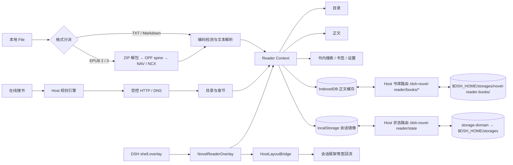

# DeepSeek Harness 侧边栏小说阅读器

一个面向 DeepSeek Harness Web UI 的本地优先小说阅读插件。它既能读取本地 TXT、Markdown 和 EPUB，也能由 DSH Host 聚合 11 个内置书源及自定义 AnyReader/亦搜小说书源，按章在线阅读或抓取整本加入本地书库。在线功能使用跨平台 Node/TypeScript 实现，不安装、不启动 SoNovel，也不需要 Java/JRE。

> **持久化说明**：阅读进度、设置、书签与最近打开由插件 Host 半区持久化到 `$DSH_HOME/storages`（通过官方 `storage-domain` 设施），书正文存于 `$DSH_HOME/storages/novel-reader-books/`。因此即使 DSH Desktop 每次启动随机分配 Web 端口（origin 变化导致浏览器 localStorage/IndexedDB 分区失效），阅读进度也不会丢失；浏览器存储仅作为同会话快速缓存与降级后备。

## 1. 架构设计说明

### 技术选型

- **React 18 + TypeScript**：DeepSeek Harness 当前 Web Client 使用 React 18，客户端扩展以 `dsh.client` 包发布。
- **React Context**：阅读器状态是单面板、单书籍域，Context 足以提供强类型状态与动作，不引入额外状态库。
- **Cordis / DSH Slots**：客户端入口只占用可叠加的 `shell.overlay`；可回收的宿主布局桥接按阅读器宽度收窄会话框架，同时保留 DSH 原生工具详情栏。样式与桥接清理均挂入 `ctx.effect()`。
- **Host 半区持久化**：Host 半区通过 `storage-domain` 官方设施把阅读状态落盘到 `$DSH_HOME/storages`（与 DSH 端口无关），并通过 `webServer` 注册 `/dsh-novel-reader/state` 与 `/dsh-novel-reader/books/*` 路由桥接浏览器；书正文以独立 JSON 文件存放，避免大对象进入领域内存表。
- **localStorage + IndexedDB（降级缓存）**：localStorage 保存小型偏好、进度和书签的同会话镜像；IndexedDB 保存正文缓存。Host 不可达时（如纯浏览器嵌入）自动降级，功能不受影响。
- **本地 EPUB 2/3 解析**：浏览器内异步解包 EPUB，按 OPF spine 确定阅读顺序，优先使用 EPUB 3 NAV、回退 EPUB 2 NCX；只提取目录与文字正文，不加载出版物中的外部资源。
- **按章节渲染**：正文始终只渲染当前章节。文件超过 10MB 时仍不会把全书 DOM 一次性挂载，减少内存和布局开销。
- **原生在线书源引擎**：Host 使用内置 SoNovel 兼容规则和 Cheerio 完成搜索、目录、章节及分页提取；规则里的任意 JavaScript 永不执行，必要变换由具名 TypeScript 函数实现。
- **自定义书源**：Host 提供 AnyReader 声明式规则适配器，支持 CSS、XPath、JSONPath、正则替换与阶段结果传递；独立 `novel_reader_rules` storage-domain 保存规则和启停状态。浏览器提供文件/粘贴导入、分步骤表单与 JSON 编辑、分阶段测试及导出。
- **安全网络边界**：浏览器只访问同源 `/dsh-novel-reader/online/*` API。Host 逐次校验协议、来源主机、重定向和 DNS 结果，阻止 localhost、私网、链路本地与云元数据地址。
- **异步抓取任务**：章节抓取有来源级并发、随机间隔、超时、重试、进度和取消；单一搜索源失败不影响其它来源。

### 数据流



### 状态结构

`ReaderContext` 持有以下域：

- `book`：当前 `Book`，包含源文本、章节和段落索引。
- `progressByBook`：以 `bookId` 为键的逐段阅读位置、章节位置与阅读秒数。
- `settings`：字体、字号、行距、主题、目录布局和缩进。
- `panel`：展开状态、280–600px 宽度、折叠按钮纵向位置、沉浸模式和工具栏可见性。
- `bookmarks` / `recents`：书签与最近 10 本书。
- `pendingParagraph`：目录、搜索或书签跳转后的待定位段落。

## 2. 项目目录结构

```text
dsh-novel-reader/
├── .codex-plugin/plugin.json        # 开发工作区元数据，不参与 DSH 运行
├── cordis.patch.yml                 # DSH bundle 配置层
├── package.json                     # dsh.bundle + dsh.client manifest
├── tsdown.config.ts                 # Host ESM + Web Client closure bundle
├── src/
│   ├── index.ts                     # Host 半区：storage-domain 持久化 + webServer 路由桥
│   ├── online/                      # 规则校验、网络引擎、任务注册表和 Host 路由
│   ├── shared/
│   │   ├── types.ts                 # 核心类型
│   │   ├── launcher-position.ts     # 折叠按钮位置校验、边界和拖拽阈值
│   │   ├── encoding.ts              # UTF-8 / GB18030 检测解码
│   │   ├── epub.ts                  # EPUB 2/3 解包、目录与正文解析
│   │   ├── parser.ts                # 目录与段落解析
│   │   ├── progress.ts              # 阅读进度
│   │   ├── search.ts                # 全文搜索
│   │   └── file.ts                  # 文件加载与体积降级
│   └── client/
│       ├── index.tsx                # shell.overlay 注册入口
│       ├── host-layout.ts           # 宿主会话框架同级布局桥接
│       ├── styles.ts                # 随插件生命周期注入的样式
│       ├── state/ReaderContext.tsx  # 状态和动作
│       ├── storage/                 # localStorage / IndexedDB
│       └── components/              # 侧栏、在线搜书、目录、正文、设置等
├── rules/main.json                  # 11 个内置 SoNovel 兼容书源
└── tests/                            # 解析、编码、在线引擎、安全和 UI API 单测
```

## 3. 核心类型定义

完整定义位于 `src/shared/types.ts`：

```ts
interface Book {
  id: string
  name: string
  format: 'txt' | 'markdown' | 'epub' | 'online'
  encoding: 'utf-8' | 'utf-8-bom' | 'gb18030'
  size: number
  content: string
  chapters: Chapter[]
  paragraphs: Paragraph[]
  largeFileMode: boolean
  origin?: { sourceId: string; sourceName: string; bookUrl: string; fetchedAt: number }
}

interface Chapter {
  id: string
  index: number
  title: string
  level: number
  start: number
  end: number
  paragraphStart: number
  paragraphEnd: number
}

interface Bookmark {
  id: string
  bookId: string
  chapterIndex: number
  paragraphIndex: number
  excerpt: string
  createdAt: number
}

interface ReaderSettings {
  fontSize: number
  fontFamily: 'system' | 'songti' | 'heiti' | 'kaiti' | 'serif'
  lineSpacing: 'compact' | 'comfortable' | 'relaxed'
  theme: 'light' | 'dark' | 'eye-care' | 'parchment'
  tocPosition: 'top' | 'left'
  firstLineIndent: boolean
  pageMode: 'scroll' | 'paged'
  footerDisplay: 'chapter-progress' | 'chapter-title'
}
```

## 4. 关键组件代码

- `NovelReaderOverlay.tsx`：同级右栏、展开/收起、拖拽宽度、折叠按钮纵向拖拽、快捷键、可切换的章节名称/章节进度底栏与视图切换。
- `FileLoader.tsx`：本地文件选择、加载反馈、错误提示和最近文件。
- `TableOfContents.tsx`：可搜索目录、当前章节高亮、左侧常驻或独立面板模式。
- `ReaderBody.tsx`：当前章节按段落渲染、搜索词高亮、逐段位置追踪，以及上下滚动/仿微信读书左右分页。
- `SettingsPanel.tsx`：12–32px 字号、5 种字体、3 档行距、4 套主题和目录布局。
- `SearchPanel.tsx`：全书搜索，Enter/Shift+Enter 导航，最多返回 500 条。
- `OnlineSearchPanel.tsx`：聚合搜书、来源信息、抓取进度、重试、取消与完成后自动阅读。
- `BookmarksPanel.tsx`：逐段书签的查看、跳转和删除。

## 5. 工具函数

- `decodeNovelBuffer()`：先检查 UTF-8 BOM，再用严格 UTF-8 解码，失败后回退 GB18030（覆盖 GBK/GB2312）。
- `parseEpubBuffer()`：校验 ZIP 安全边界，读取 container.xml 与 OPF，按 spine 提取 XHTML 正文，并从 EPUB 3 NAV 或 EPUB 2 NCX 建立分层目录；目录不可用时回退正文标题。
- `parseBookText()`：识别“第 X 章/回/节”“Chapter X”“1. 标题”“001 标题”和 Markdown `#`–`###`。
- `calculateProgress()`：基于全局段落索引计算当前章节和全书百分比。
- `searchBook()`：在段落索引中定位结果，返回章节、段落与摘要坐标。
- `loadBookFromFile()`：格式、体积、编码和解析的统一错误边界。

体积策略：10MB 以下正常加载；10–50MB 启用按章节渲染提示；超过 50MB 拒绝并建议拆卷。即使缓存因配额失败，本次会话仍可继续阅读。

## 6. 平台集成代码

`package.json` 同时声明：

```json
{
  "dsh": {
    "bundle": { "patch": "./cordis.patch.yml" },
    "client": {
      "inject": [
        "@deepseek-ai/dsh-client-ui-renderer",
        "@deepseek-ai/dsh-client-ui-layout"
      ],
      "platform": "web"
    }
  }
}
```

`cordis.patch.yml` 把包加入 profile；`src/client/index.tsx` 使用：

```ts
ctx.slots.inject('shell.overlay', () => ctx.slots.register({
  name: 'shell.overlay',
  id: 'dsh-novel-reader',
  order: 90,
}, ReaderSlot))
```

DSH 仍处于 Developer Preview，本项目锁定 `0.2.0-rc.2` 客户端契约，已适配 DSH Desktop 2.0.17。平台升级后应先运行类型检查和 Web 冒烟测试。

## 6.1 DSH Desktop 适配说明

`0.2.1` 将已移除的 `dsh-client-runtime` 迁移至 `dsh-client-ui-renderer`，并同步 Cordis、插槽和存储依赖。升级后需要重启 Desktop，让宿主重新读取 manifest 和客户端依赖图；旧版 DSH `0.1.x` 请使用阅读器 `0.2.0`。

插件对 DSH Desktop 三种壳模式做了针对性适配（无需配置，自动生效）：

- **advanced / extended（桌面自有 frame）**：宿主把 `shell.overlay` 层设在 `z-index:1000`，与应用级弹窗（设置、附件选择器等同为 `z-index:1000`）同层时按 DOM 顺序反而压住弹窗，导致阅读器盖住设置界面。插件将叠加层压到 `z-index:60`（帧内 UI 之上、应用弹窗之下）。
- **compatibility / extended（transform + 裁剪包含块）**：宿主给 overlay 层同时加 `transform` 与 `overflow:hidden`。插件不再缩窄整个 frame 或把阅读器移出 overlay，而是在宿主三栏网格末尾追加一个阅读器专用轨道；对话区照常回流，overlay 保持完整宽度，因此不会再露出黑色/玻璃窗口背景。布局桥还会监听宿主的侧栏、详情栏与窗口尺寸变化，自动重挂阅读器轨道。
- **快捷键隔离**：应用级弹窗（`[aria-modal="true"]`）打开时，阅读器不响应翻页、搜索、展开/收起等快捷键，键盘输入完全交给弹窗。
- **折叠按钮定位**：右侧“阅读”按钮以当前 `shell.overlay` 可视区域为坐标系，自动避开 Desktop 标题栏；窗口缩放或切换壳模式后按相对位置重新布局。

## 7. 安装、运行与打包

### 本地开发

```bash
pnpm install
pnpm run typecheck
pnpm test
pnpm run build
```

在已安装 `dsh` CLI 的环境中，把本目录加入一个 profile：

```bash
dsh plugin --profile reader add ./deepseek-novel-reader
dsh --profile reader --dump-config
dsh --profile reader web
```

如果从 Git 仓库安装，pnpm 10+ 默认禁止依赖运行 `prepare`。需要在该 profile 的 `pnpm-workspace.yaml` 明确允许：

```yaml
allowBuilds:
  dsh-novel-reader: true
```

更安全的分发方式是交付已构建 tarball：

```bash
pnpm run build
pnpm pack
dsh plugin --profile reader add ./dsh-novel-reader-0.2.1.tgz
```

### 使用

1. 启动 DSH Web UI 后，点击右侧“阅读”按钮；收起状态下也可沿右侧边缘上下拖动它，位置会自动保存。
2. 选择 `.txt`、`.md`、`.markdown` 或无 DRM 的 `.epub` 文件；也可点“在线搜书”，选择结果后点“在线阅读”按需加载章节，或点“加入书库并阅读”抓取整本。
3. 拖动面板左边缘调整宽度；展开状态和宽度会自动保存。
4. 工具栏“搜书”用于在线聚合搜索，“搜索”用于当前书全文搜索；`Ctrl/Cmd+F` 行为仍是书内搜索。`Esc` 返回正文。
5. 点击正文空白/文本区域切换沉浸模式。

## 版本范围

### MVP（本仓库已完成）

- TXT / Markdown、本地编码检测、章节解析与目录过滤
- EPUB 2/3、本地异步解包、OPF spine 阅读顺序、EPUB 3 NAV / EPUB 2 NCX 目录与 fragment 分章
- 侧栏展开/收起、280–600px 宽度拖拽、折叠按钮纵向拖拽、状态恢复和过渡动画
- 逐段进度、双进度条、最近 10 本、书签、上/下一章
- 字体/字号/行距/主题、底部章节名称/进度显示、全文搜索、快捷键和沉浸模式
- 上下滚动与左右分页两种阅读方式，设置自动保存
- 10MB 大文件按章节渲染、50MB 上限与存储失败降级
- Host 原生聚合搜书、短期 opaque 结果 ID、异步章节抓取、进度/重试/取消和在线书籍稳定 ID
- 书源/重定向/DNS SSRF 防护、同源 API、可配置并发/超时/限流/代理和 11 个内置书源

### V1.0（建议下一阶段）

- 超大文件流式解码与虚拟段落列表
- 按日/周阅读时长统计和导出
- Playwright 宿主级视觉回归测试

## 在线引擎配置

| 配置 | 默认值 | 说明 |
| --- | ---: | --- |
| `searchConcurrency` | 6 | 同时搜索的书源数 |
| `chapterConcurrency` | 20 | 同一抓取任务的章节并发上限 |
| `requestTimeoutMs` | 15000 | 单请求超时 |
| `searchTimeoutMs` | 60000 | 整次聚合搜索超时 |
| `maxRetries` | 3 | 章节失败后的最大重试次数 |
| `minRequestIntervalMs` / `maxRequestIntervalMs` | 200 / 400 | 每章请求前随机等待区间 |
| `maxSearchResults` | 100 | 聚合结果上限 |
| `proxyUrl` | 未设置 | 可选 HTTP/HTTPS 代理 |

非法数值、反向间隔、无效规则或非 HTTP(S) 代理会让插件明确加载失败。

## 隐私与网络

本地文件不会上传，EPUB 也不会加载出版物中的外部资源。使用“在线搜书”或规则测试时，Host 会请求相应第三方书源；浏览器不会直连书源。在线内容没有可用性、准确性或持续服务保证，插件不会绕过登录、限流或 Cloudflare 验证。DNS 与重定向只允许规则固定声明的主机及显式配置的 `allowedHosts`；不会根据源站返回内容自动增加授权。为兼容 Clash 等 TUN/Fake-IP 环境，这些已授权主机可以解析到代理保留网段 `198.18.0.0/15`，其他本机、局域网、链路本地和元数据地址仍会被拒绝。正文、进度、书签、设置和自定义规则保留在当前设备的 DSH Host 存储中。

## 自定义小说书源

### 在线按章阅读

搜索结果的“在线阅读”先加载完整目录和当前章节，无需下载整本，也不依赖 IndexedDB 正文存储。目录跳转、上一章/下一章、键盘导航和分页跨章均按需请求目标章节；正文仅保留当前章节在内存中，不写入本地书库。章节内的源站分页仍会合并。

最近打开、阅读进度和书签继续通过现有 Host 状态存储保存。点当前仍在内存中的在线书籍可直接返回阅读页；重启或切换书籍后，URL 型书源通过保存的书籍链接重新加载目录，不依赖搜索结果。需要搜索对象作为请求上下文的 AnyReader API 规则仍会重新搜索以恢复阶段上下文。随后加载保存的章节和段落。在线阅读与整本缓存使用独立记录；在线模式搜索仅覆盖当前章节，整本进度按章节数量估算。会话过期会自动重连，加载失败保留当前正文，并提供“重试章节”。书源停用或删除后需先恢复；书源连接失败仍须修复网络或更换来源。

Host 接口：`POST /dsh-novel-reader/online/readings` 接收搜索结果 ID 或最近记录的书源引用；`GET /dsh-novel-reader/online/readings/:id/chapters/:index` 只加载指定章节；`DELETE /dsh-novel-reader/online/readings/:id` 释放会话。会话仅保存书源规则快照与目录，不缓存正文；关闭会话、插件卸载及客户端断开会取消相关请求。续读链接仍须通过书源声明的主机、重定向及 DNS 安全校验；不接受任意请求描述。

在“在线搜书”页面点“书源管理”，空书库也可使用。内置书源支持启停、查看、测试和导出；修改时选择“复制并编辑”。自定义书源支持新建、编辑、删除及导出。管理依赖 Host，连接失败时会明确提示并提供重试。

### 导入和编辑

1. 选择 JSON、JSON5 或 TXT 文件，或粘贴单条规则、规则数组、`eso://作者:名称@压缩数据`。
2. 点“校验并预览”，查看兼容性及重复 ID。每批最多 200 条、1 MiB；ESO 使用与 AnyReader 一致的 Base64 + zlib DEFLATE，解压后的内容也受 1 MiB 限制。
3. 同 ID 默认跳过，勾选“更新同 ID 规则”后才替换。不兼容规则保留原始字段但禁用，不会影响其它书源。
4. 编辑器按基本信息、搜索、目录、正文分组，也可切换原始 JSON；未展示的字段会保留。保存后立即更新搜书来源。

规则优先使用导入文件的 `id`；缺失时生成 UUID。自定义来源 ID 与内置 `sonovel-*` ID 隔离。规则和内置启停状态保存在独立的 `novel_reader_rules` 领域中，重启或 Web 端口改变后仍可恢复。导出为 JSON，保留未知字段与不兼容字段，不包含临时测试句柄。

下面的模板仅示范字段，需要按实际网站的页面结构填写：

```json
{
  "name": "我的小说书源",
  "host": "https://example.com",
  "contentType": 1,
  "enableSearch": true,
  "searchUrl": "/search?q=$keyword",
  "searchList": ".book",
  "searchName": "a@text",
  "searchAuthor": ".author@text",
  "searchResult": "a@href",
  "chapterUrl": "$result",
  "chapterList": ".chapters a",
  "chapterName": "@text",
  "chapterResult": "@href",
  "contentUrl": "$result",
  "contentItems": "#content@html"
}
```

### 兼容范围

| 功能 | 支持情况 |
| --- | --- |
| 小说 `contentType: 1` | 支持；其它类型保留但禁用 |
| CSS / XPath / JSONPath | 支持显式前缀和默认识别，JSONPath 不执行过滤脚本 |
| 文本、属性、`html` / `innerHtml` / `outerHtml` / `textNodes` | 支持；最终正文及预览转换为纯文本 |
| `##` 正则替换、`@replace:`、`{{规则}}`、`||`、`&&`、解析级联 | 支持；拒绝嵌套重复等高复杂度正则 |
| URL 字符串、JSON GET/POST 请求、请求头、JSON/表单请求体 | 支持；请求头不能覆盖 Host 等传输控制字段 |
| `$host`、`$keyword`、`$result`、`result`、`lastResult` | 支持；URL 中关键词编码，阶段结果保留原始 JSON 值 |
| `chapterNextUrl` / `contentNextUrl` | 支持，沿下一页链接抓取、检测循环，每阶段最多 12 页 |
| `searchNextUrl` | 插件扩展字段，处理搜索下一页链接 |
| `@js`、`loadJs`、浏览器规则、`contentDecoder`、多线路 | 不执行；保存原文、列出字段诊断并禁用 |
| 发现页、漫画、音视频、订阅及自动更新 | 首版不提供；未知元数据字段保留 |
| SoNovel | 保留现有规则格式；内置及其副本使用已知具名变换，不执行任意规则脚本 |

`searchResult` 和 `chapterResult` 可以输出对象。下一阶段可用 `{{$.id}}` 生成请求地址，或在 JSON 请求体中使用 `"$result"` 传入完整对象。`chapterUrl` / `contentUrl` 空值则使用阶段结果作为请求描述或地址。相对 URL 基于当前页面解析；请求描述中的固定 HTTP(S) 主机自动纳入当前书源授权。额外域名在基本信息中的 `allowedHosts` 配置为数组，如 `["cdn.example.com"]`，不支持通配符。

### 分阶段调试

在编辑页输入测试关键词，按“测试搜索 → 选择书籍 → 目录 → 选择章节 → 正文”检查当前草稿。界面显示请求地址、解析结果及字段错误；列表最多预览 100 项，正文测试仅抓取选中章节及其分页，不保存书籍。

测试句柄在 Host 内短期保存，15 分钟后或修改规则后失效；遇到过期提示，请从搜索重新测试。搜索结果同样有 15 分钟有效期；编辑、禁用或删除来源后，旧结果不能再创建抓取任务，需重新搜索。已开始的抓取使用任务启动时的规则快照，不受后续编辑影响。

常见问题：无搜索结果时检查 `searchList`、`searchName` 与 `searchResult`；JSON API 规则使用 `@json:` 或 `$` 开头；目录/正文链接解析失败时检查阶段结果与请求模板；跳转被拒绝时仅在明确需要时增加固定授权域名。含脚本的规则需要改写为声明式表达式后才能启用。

## 许可证与归属

自 `0.2.0` 起，因内置并改写 SoNovel 规则与设计，本项目整体按 [AGPL-3.0](./LICENSE) 发布。原 MIT 版权与许可声明、SoNovel 归属和对应源码说明见 [NOTICE](./NOTICE)。npm 包同时包含 `src/`、`tests/`、规则和构建配置；完整源码也持续发布在本仓库。

## 参考

- [DeepSeek Harness 官方仓库](https://github.com/deepseek-ai/deepseek-harness)
- [DSH 插件开发文档](https://deepseek-harness.github.io/deepseek-harness/develop/basic/)
- [SoNovel（AGPL-3.0）](https://github.com/freeok/so-novel)
- [AnyReader 规则说明](https://aooiuu.github.io/any-reader/rule/)
- [AnyReader 规则编解码源码](https://github.com/aooiuu/any-reader/blob/master/packages/rule-utils/src/comparess.ts)
